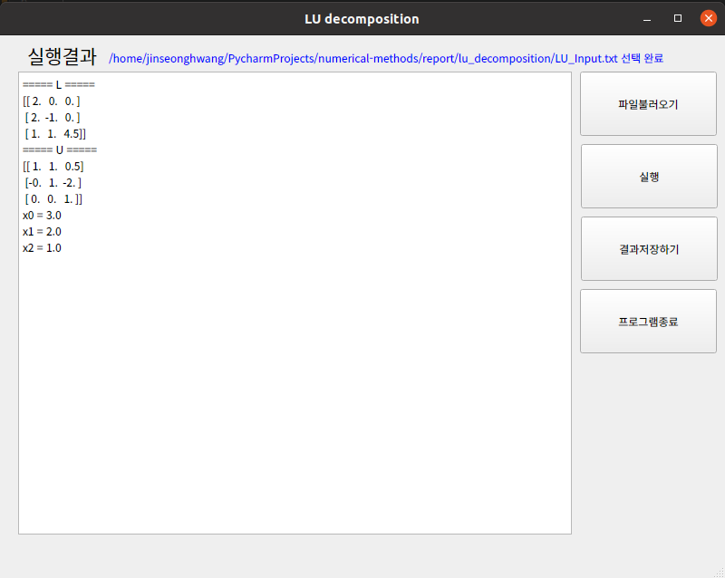

# LU 분해법 구현 과제

수치해석 02분반<br>
컴퓨터공학과 1723940 황진성 작성<br>

### main 함수는 ui.py 에 있습니다. ui.py를 실행 시켜 주십시오.

## 사용하는 라이브러리 및 설치

- numpy
```text
pip install numpy
```

- PyQt5
```text
pip install PyQt5
```

## 입력 파일

```text
3
2 2 1 11
2 1 3 11
1 2 3 10
```
- 첫 줄에는 행렬의 크기 N이 주어진다.
- 2번째 줄부터 N + 1번째 줄까지 b 가 포함된 확장 행렬 형태로 주어진다.

## 프로그램 실행 방법

1. "파일 불러오기" 버튼을 클릭해서 입력 파일을 가져옵니다.
2. "실행" 버튼을 클릭하면 LU 분해법에 따라 L과 U 결과 행렬과 해를 화면에 출력합니다.
3. "결과 저장하기" 버튼을 클릭하면 출력된 결과를 파일로 저장할 수 있습니다.
4. "프로그램 종료" 버튼을 클릭하면 프로그램이 종료됩니다.

- 프로그램 실행 순서를 꼭 따라주시길 바라며, 4번을 제외한 나머지 기능은 실행 순서에 의존적입니다.

## 실행 결과

